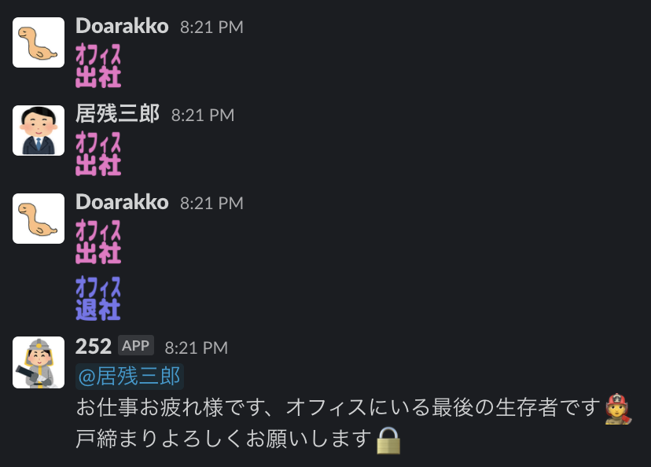
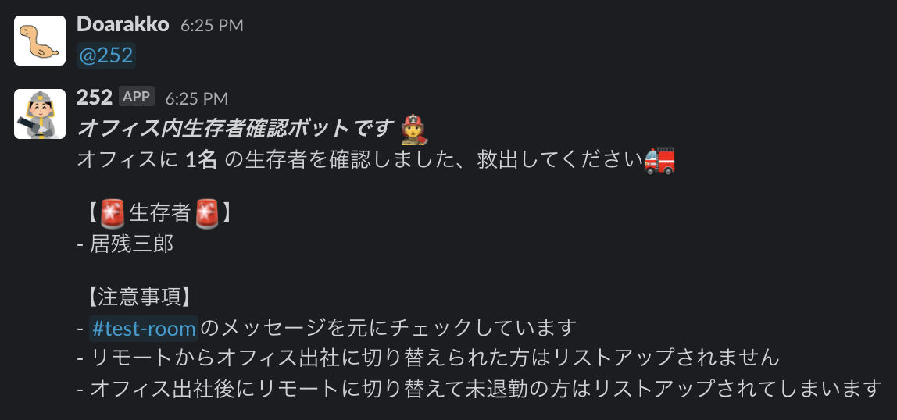

# 252

Slack bot that sends a message to the last person in the office using attendance log in Slack channel.



You can list people who are still in the office and working.



Prevents the office from being locked when someone is in the office.

## Requirements

- Node.js
- Slack
- Heroku

## Usage

### 1. Create Slack App using `manifest.yml`

### 2. make `.env`

```sh
cp .env.example .env
```

Enter your environment variables to `.env`.

```txt
SLACK_APP_TOKEN=xapp-aaaa
SLACK_BOT_TOKEN=xoxb-bbbb
SLACK_CHANNEL_ID=CCCCCCCC
SLACK_IN_OFFICE_MESSAGE=:in_office:
SLACK_OUT_OFFICE_MESSAGE=:out_office:
SLACK_IN_HOME_MESSAGE=:in_home:
SLACK_OUT_HOME_MESSAGE=:out_home:
```

### 3. Run

```sh
npm run dev
```

## Run on Heroku

[](https://heroku.com/deploy)
